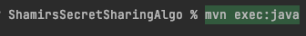
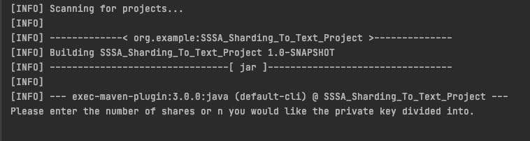

# ShamirsSecretSharingAlgo
A maven project app implementing Shamir's Secret Sharing Algorithm to reassemble an RSA private key using Shards.

## Navigate to your workspace
1. `cd {folder}`
    * You will clone the repository in this directory.

## Clone the Project
1. Clone repository into your localhost via command line terminal.
    *   ` git clone git@github.com:RicoVergara94/ShamirsSecretSharingAlgo.git`

## Building the Maven Project
* **Depending on the IDE you may be prompted to enter commands on your terminal using the &#8984; and Enter button'**
1. `mvn clean`
    * Cleans the project and removes all files generated by the previous build.
    
2. `mvn compile`
    * Compiles source code of the project.
    
3. `mvn test`
    * Runs tests for the project.
    
4. `mvn install`
    * Deploys the packaged JAR/ WAR file to the local repository.

## Running the Project

1. `mvn exec:java`
    * The main class will begin running. 
    * You will begin to be prompted on the terminal for your input.

2. Begin entering input.